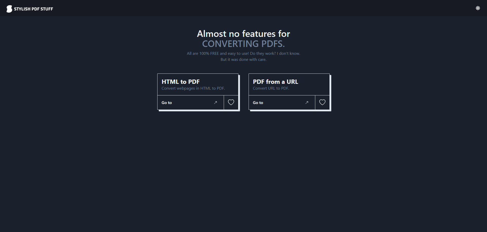
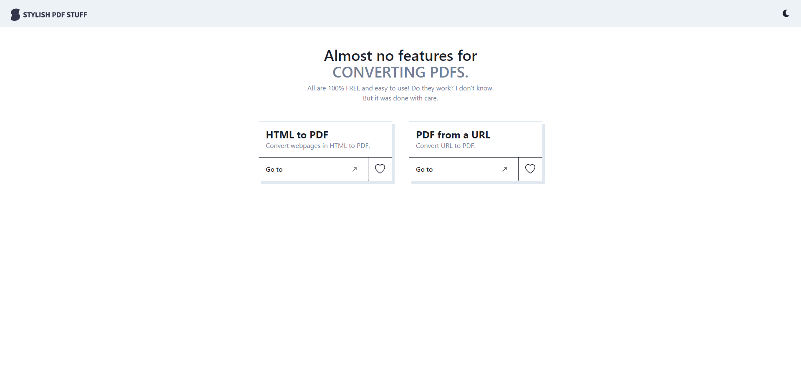
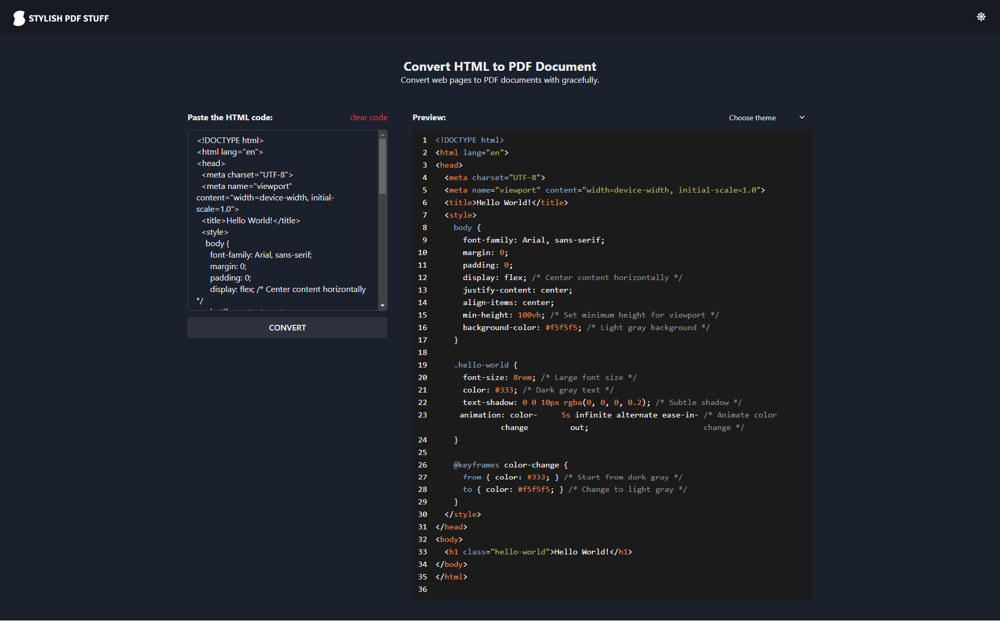
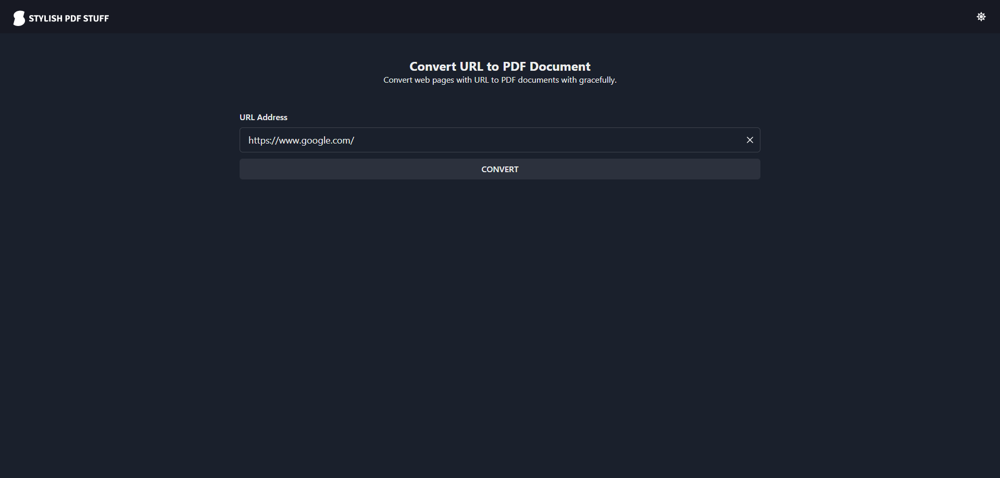

# STYLISH PDF STUFF

<!-- PROJECT LOGO -->
<!-- markdownlint-disable -->
<div align="center" style="margin-top: 24px">
  
  
  <h3 align="center">A server/client application to train NestJS, Puppeteer, React, TypeScript, Formik, Yup and Chakra UI.</h3>
</div>
<!-- markdownlint-disable -->

<!-- LAYOUT PREVIEW -->
## LAYOUT

### Home




### HTML to PDF



### URL to PDF



<!-- GETTING STARTED -->
## Getting Started

This is an example of how you may give instructions on setting up your project locally.

### Installation

1. Clone the repo

   ```shell
   git clone git@github.com:allanfoppa/stylish-pdf-stuff.git
   ```

2. Run a server command

   ```shell
   npm i # if first time
   npm run start:dev
   ```

3. Run a client command

   ```shell
   npm i # if first time
   npm run start
   ```

## FINAL CONSIDERATIONS

This application is a practice project built to explore technologies and concepts. It's not intended for commercial use and may not adhere to best practices for production environments.
Feel free to explore, contribute, or provide feedback. Thank you for checking it out!
